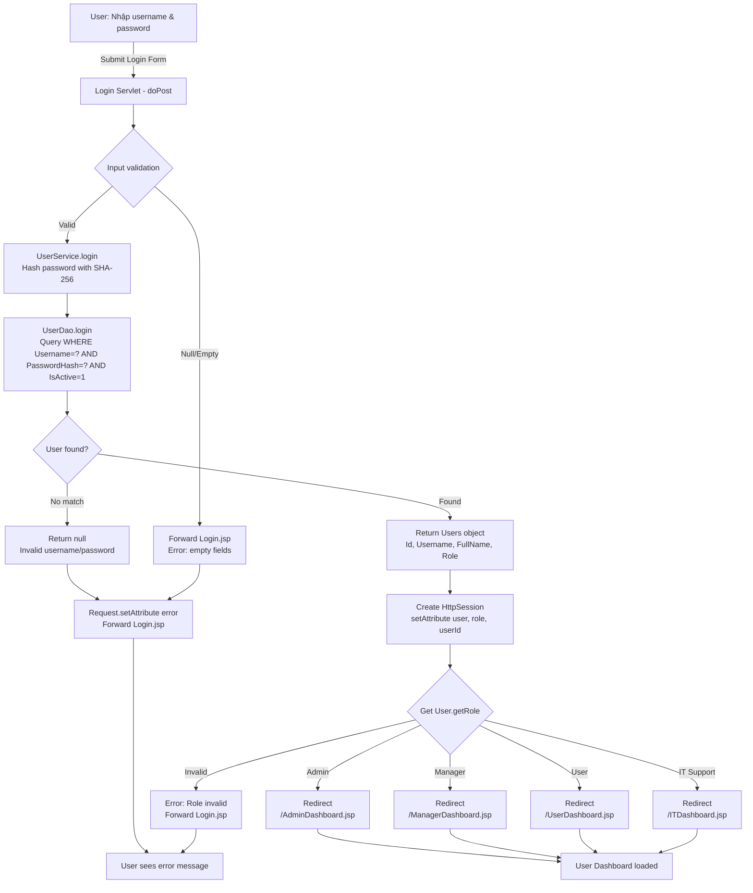
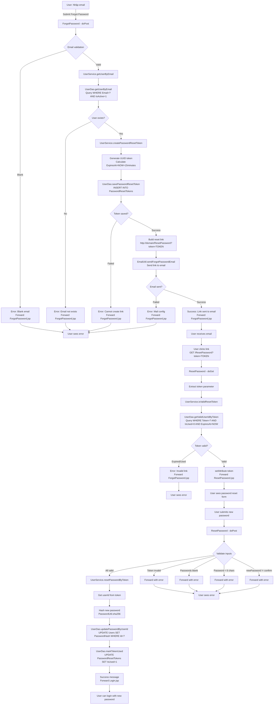
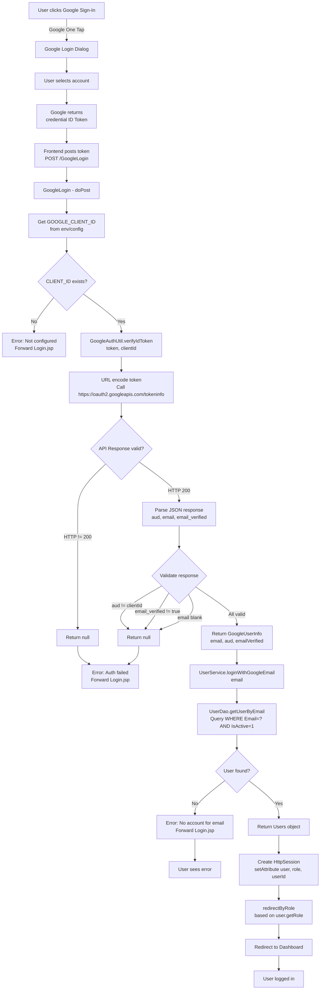
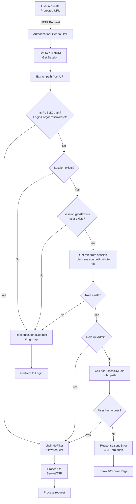
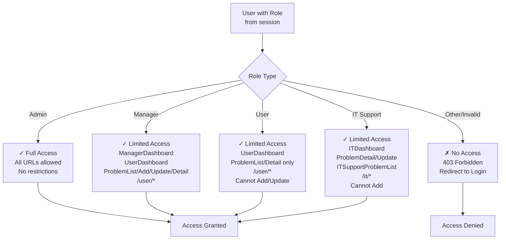
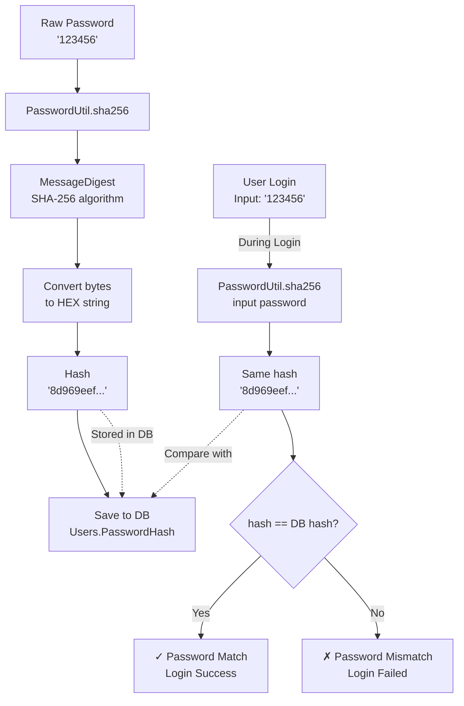
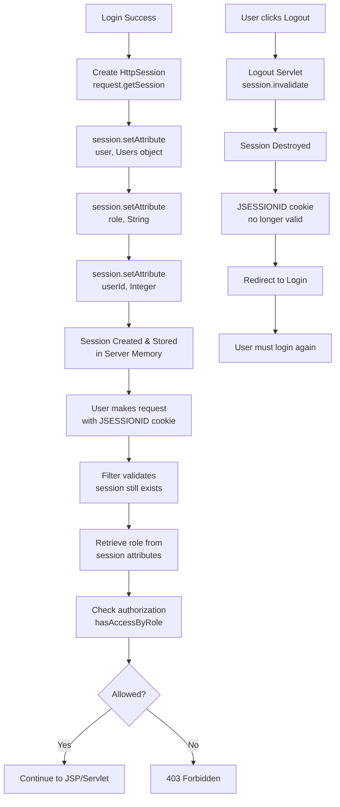
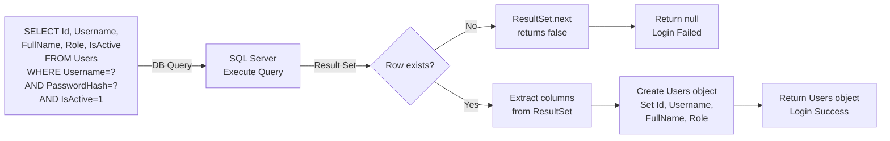
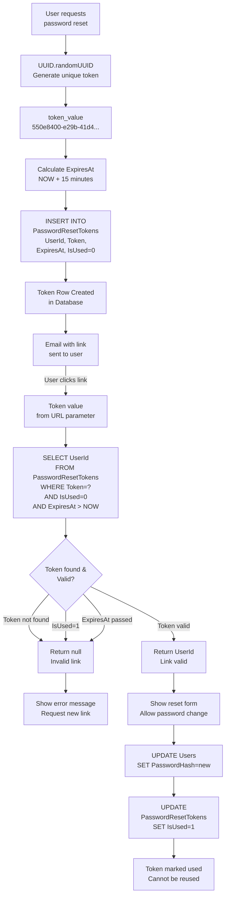
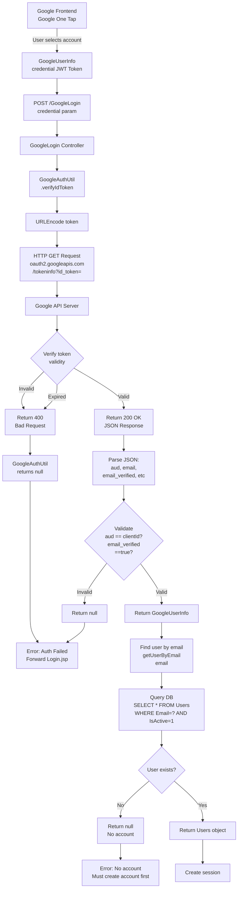

# DIAGRAM & FLOW VISUALIZATION

## 1. Login Flow Diagram

## 2. Password Reset Flow (Forgot Password)

## 3. Google Login Flow

## 4. Authorization Filter Flow

## 5. Role-Based Access Control (RBAC)

## 6. Password Hash & Verification Flow

## 7. Session Management

## 8. Database Transaction: Login

## 9. Email Token Generation & Validation

## 10. Google OAuth 2.0 Token Verification

