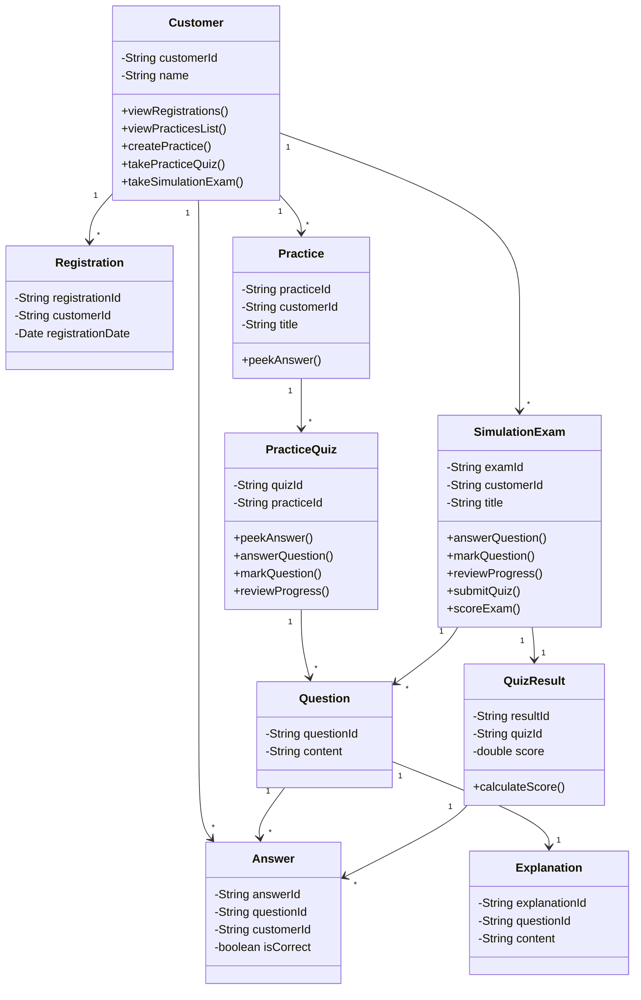

# Quiz Practicing System - Class Diagram (Simplified)

Class diagram đơn giản dựa trên Use Case Diagram.

## Mermaid Class Diagram

## Mô tả các lớp

- **Customer**: Người dùng hệ thống
- **Registration**: Đăng ký của khách hàng
- **Practice**: Phiên luyện tập
- **PracticeQuiz**: Quiz luyện tập (có thể peek answer)
- **SimulationExam**: Bài thi mô phỏng
- **Question**: Câu hỏi
- **Answer**: Câu trả lời
- **QuizResult**: Kết quả bài thi
- **Explanation**: Giải thích đáp án

## Ghi chú

- File PlantUML: `QuizPracticingSystem_ClassDiagram.puml`
- File Mermaid: Xem diagram trên
